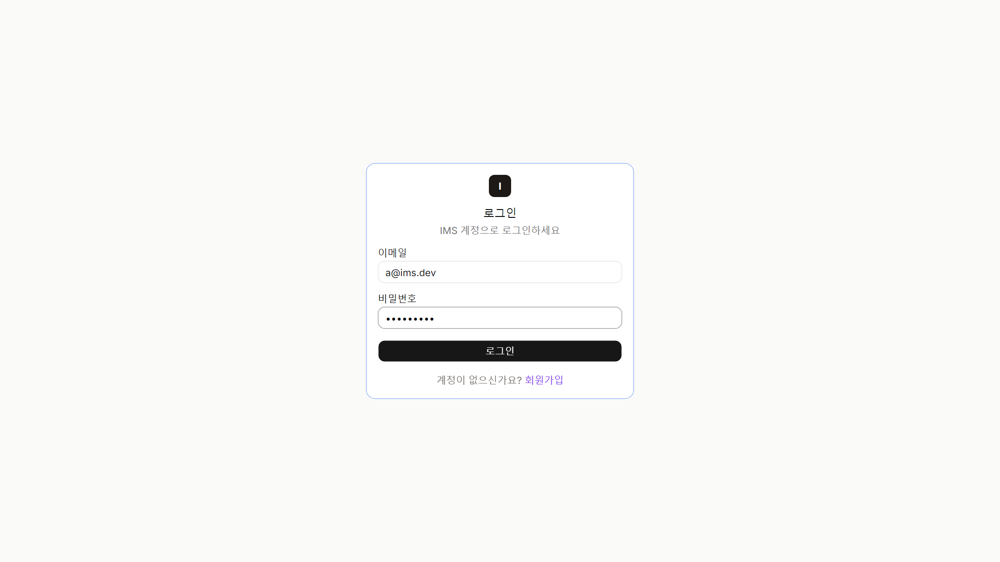

# IMS — Inventory Management System

> 제조업 본사-하청 협업을 위한 BOM 기반 재고관리 시스템



## Overview

본사-하청 간 재고 협업은 ERP 도입 후에도 엑셀로 처리되는 경우가 많습니다. 협력사마다 재고 기준이 달라 생산 계획이 어긋나고, 부품 부족은 결산 후에야 드러납니다.

IMS는 회사 단위 계정과 초대 기반 Partnership으로 협력사를 연결합니다. 창고 공유 권한(VIEW/FULL), BOM 기반 최대 생산량 자동 계산, 자정 배치 결산까지 하나의 시스템에서 처리합니다.


## Tech Stack

| 영역 | 기술 |
|------|------|
| Backend | Java 21, Spring Boot 3.x, Spring Security, Spring Data JPA, Spring Batch |
| Database | MySQL 8.x (주 저장소), Redis (Refresh Token · BOM 캐시) |
| Frontend | Next.js 14 (App Router), TypeScript, Tailwind CSS, shadcn/ui |
| Auth | JWT — Access Token (1h) + Refresh Token (2주, Redis 저장) |
| Test | JUnit 5, Mockito, @WebMvcTest, @DataJpaTest |
| Infra | Docker, Docker Compose |

## 시스템 구조

```
┌──────────────────────────────────────────────────────┐
│  Next.js 14 (App Router)                             │
│  대시보드 · 재고 · 생산 · 파트너 · 분석              │
└─────────────────────┬────────────────────────────────┘
                      │ REST API (JWT Bearer)
┌─────────────────────▼────────────────────────────────┐
│  Spring Boot 3 — 기능별 패키지                        │
│  user · partnership · warehouse · item               │
│  inventory · production · global                     │
│                  ┌───────────────┐                   │
│  Spring Batch ──▶│ 자정 결산 배치 │ (cron 00:05)      │
│                  └───────────────┘                   │
└──────┬──────────────────────────────┬────────────────┘
       │ JPA                          │ RedisTemplate
┌──────▼──────┐               ┌───────▼───────┐
│  MySQL 8    │               │     Redis     │
│  (주 DB)    │               │  (토큰 · 캐시) │
└─────────────┘               └───────────────┘
```

## 핵심 도메인

### 회사 간 협력 구조 (Partnership)

각 회사가 독립 계정으로 가입 후, 초대 토큰 방식으로 본사-하청 관계를 맺습니다.

```
이스마트코리아(E) ──[ACCEPTED]──▶ 아이테크조립(A) ──[ACCEPTED]──▶ 비전전자(B)
                                        │
                                        ├──[ACCEPTED]──▶ 씨메카닉스(C)
                                        │
                                        └──[PENDING] ──▶ 디로지스(D)  ← 초대 대기 중
```

- 하청은 여러 본사에 동시 소속 가능 (다중 Partnership)
- 창고 공유(WarehouseShare)는 ACCEPTED 관계인 파트너에게만 부여 가능
- 공유 권한: `VIEW` (조회만) / `FULL` (입출고 포함)

### BOM 기반 생산 계획

`ITEM` 테이블 하나로 완성품 · 반제품 · 부품을 통합 관리합니다.  
BOM은 ITEM 간 셀프 조인으로 다단계 구조를 구성합니다.

```
스마트스피커 (PRODUCT)
├── 메인보드 (SEMI) × 1
│    ├── PCB기판 (PART) × 1
│    ├── WiFi/BT모듈 (PART) × 1
│    └── 전원IC (PART) × 4
├── 스피커유닛 (PART) × 1
├── 마이크모듈 (PART) × 2
├── 케이스(소) (PART) × 1
└── DC어댑터 (PART) × 1
```

- BOM 트리 전체 탐색 → 부품별 필요 수량 계산 → 창고 재고와 비교 → **최대 생산 가능 수량 자동 산출**
- 순환 참조 방지 (DFS 검사)
- BOM 탐색 결과 Redis 캐시 (TTL 1h, BOM 변경 시 evict)

### 생산 기록 & 자정 결산 배치

```
생산 기록 등록 (PENDING)
    │
    ├─ 결산 전 → CANCELLED 처리 가능
    ├─ 강제 결산 → 즉시 Settlement 생성
    │
    └─ 자정 배치 (Spring Batch, 00:05)
         │  전날 PENDING 레코드 일괄 처리
         ├─ BOM 기반 부품 재고 차감
         ├─ InventoryHistory (PRODUCTION_DEDUCTION) 기록
         ├─ Settlement 생성 — SUCCESS / ANOMALY
         └─ ProductionRecord.status → SETTLED
```

레코드별 독립 트랜잭션 (`REQUIRES_NEW`). 한 건 실패가 다른 결산을 롤백하지 않음.  
BOM 부품 재고는 단일 IN 쿼리로 일괄 조회하여 N+1 방지.

`Settlement`를 별도 엔티티로 분리한 이유: **결산 로직을 생산 기록 없이 독립 단위 테스트로 검증**하기 위해.  
부품 재고 부족 시 `anomalyDetail`에 품목별 필요량 · 현재 재고를 JSON으로 기록합니다.

## 테스트 전략

TDD로 개발. 총 **240개 이상의 테스트 케이스**, 라인 커버리지 90%+.

| 레이어 | 도구 | 검증 대상 |
|--------|------|----------|
| Service 단위 | Mockito | 결산 SUCCESS/ANOMALY, 권한 검증, BOM 탐색, 재고 차감 |
| Controller 슬라이스 | @WebMvcTest | 엔드포인트 응답 코드, 인증 필터, JSON 직렬화 |
| Repository 슬라이스 | @DataJpaTest | BOM 다단계 조회, 재고 집계 쿼리 |
| 배치 통합 | @SpringBootTest | PENDING → SETTLED 전체 플로우, ANOMALY 처리 |
| Security | Spring Security Test | 미인증 401, 권한 없음 403 |

## Getting Started

### Prerequisites

- Docker & Docker Compose
- Java 21 (로컬 실행 시)
- Node.js 20+ (로컬 실행 시)

### Docker Compose로 전체 실행 (권장)

```bash
# 최초 실행 (이미지 빌드 + DB/Redis 포함)
docker-compose up --build -d

# 재시작 (코드 변경 없을 때)
docker-compose up -d
```

앱 기동 시 `DataInitializer`가 자동으로 데모 데이터를 삽입합니다.

| 서비스 | 주소 |
|--------|------|
| Frontend | http://localhost:3000 |
| Backend API | http://localhost:8080/api/v1 |
| MySQL | localhost:3306 |
| Redis | localhost:6379 |

### 로컬 개발 실행

```bash
# MySQL + Redis만 Docker로 실행
docker-compose up -d mysql redis

# 백엔드
cd backend
./gradlew bootRun

# 프론트엔드
cd frontend
npm install
npm run dev
```

## 프로젝트 구조

```
IMS/
├── backend/
│   ├── src/main/java/com/ims/
│   │   ├── user/            # 회사 계정 관리, JWT 인증
│   │   ├── partnership/     # 본사-하청 초대 · 수락 · 관리
│   │   ├── warehouse/       # 창고 CRUD, 공유 권한(WarehouseShare)
│   │   ├── item/            # 품목 마스터 (PRODUCT · PART · SEMI)
│   │   ├── inventory/       # 창고별 실시간 재고, 입출고 이력
│   │   ├── production/      # 생산 기록, Settlement, ProductionOrder
│   │   └── global/
│   │       ├── security/    # JwtProvider, JwtAuthFilter, SecurityConfig
│   │       ├── scheduler/   # SettlementBatchConfig, SettlementJobScheduler
│   │       ├── config/      # RedisConfig, BatchConfig, DataInitializer
│   │       └── exception/   # ImsException, ErrorCode, GlobalExceptionHandler
│   └── src/test/            # 단위 · 통합 · 슬라이스 테스트 (240개 이상)
│
├── frontend/
│   └── app/
│       ├── (auth)/login/    # 로그인 페이지
│       └── (main)/
│           ├── dashboard/   # KPI, 생산 추이
│           ├── inventory/   # 재고 목록, 입출고
│           ├── production/  # 생산 기록, 결산
│           ├── partners/    # Partnership 관리
│           └── analytics/   # 분석, 안전재고 추천
│
├── docs/
│   └── API.md               # REST API 전체 명세
└── docker-compose.yml
```

## License

MIT
